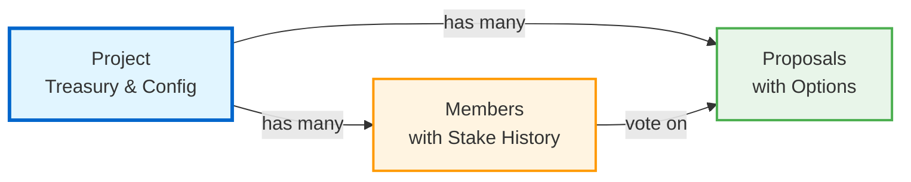
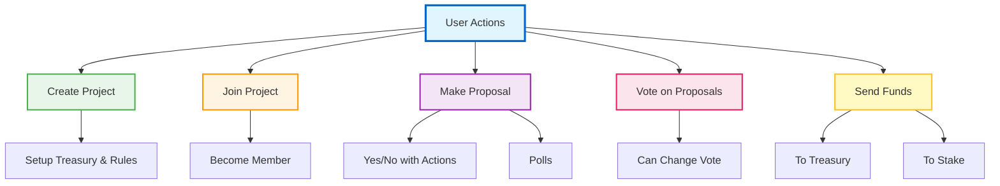
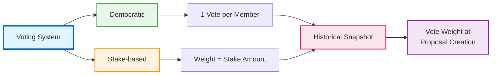
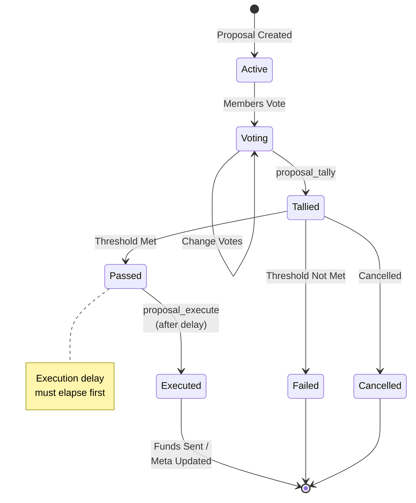

# Oinoko DAO – User Guide

This smart contract powers community-driven projects on the [Magi Ecosystem](https://github.com/vsc-eco/). It allows users to create projects, join them, make proposals, vote on proposals, and manage shared funds - all in a transparent, on-chain way powered by Magi smart contracts fully integrated on [okinoko.io](https://okinoko.io).

---

## Architecture Overview



**How it works:**
- **Projects** hold the treasury and governance rules
- **Members** join by staking tokens, each stake change is recorded with a timestamp
- **Proposals** are voted on using your stake at the time the proposal was created
- Your vote weight is always based on your historical stake, preventing manipulation

---

## 1. What You Can Do



- **Create a Project**  
  Start your own community project with a name, description, voting rules, and a shared treasury.
  You decide:
  - Who can make proposals (just you, all members or anyone)
  - How members join (fixed fee for equal voting or stake-based for weighted voting)
  - The percentage of votes needed for approval
  - Proposal cost (goes into project funds)
  - Proposal duration (in hours)
  - Minimum/Exact join amounts needed for users to join
  - Optional: Adding an nft on the upcoming Magi nft contract that functions as whitelist for joins

- **Join a Project**  
  Become a member by sending the required join amount (set by the project).
  - In **Democratic voting** projects, every member’s vote counts equally.
  - In **Stake-based voting**, your vote weight depends on your contribution amount. (Your stake is never used as project funds)

- **Make a Proposal**
  Suggest an action or ask the community a question.
  Proposal types:
  - **Yes/No** (can also execute fund transfers or project meta changes if approved)
  - **Single Choice Poll**
  - **Multiple Choice Poll**

  Every proposal has:
  - Title, description, and optional metadata
  - Duration for voting
  - Custom options with optional reference URLs (for polls and multi-choice)
  - Receiver (only for Yes/No fund transfers)
  - Cost (defined by the project, goes into treasury)
  - Project meta keys to update

- **Vote on Proposals**  
  Members vote according to the project’s rules. Votes can be changed until the proposal gets tallied. Tallying and execution are explicit calls (`proposal_tally`, `proposal_execute`) and can be managed through [okinoko.io](https://okinoko.io).

- **Send Additional Funds**
  You can add funds to the project's treasury in **any supported asset** (HIVE, HBD, etc.) at any time to help the community achieve its goals. The treasury tracks each asset balance separately, allowing multi-asset management.

  In stake-based projects you can also increase your personal stake (and vote weight) by calling `project_funds` with `toStake=1`. **Note:** Staking must use the project's base membership asset (typically HIVE), while treasury deposits accept any asset.

**Important note:** Your vote weight on existing proposals is based on your stake at the time each proposal was created. Increasing your stake after a proposal is created won't affect your vote weight on that proposal.

- **Project Pause Switch**  
  The project owner can activate a pause switch for the project. No new proposal can be created and no proposal can be executed in this stage. One big exception is a proposal with the only outcome to deactivate that pause switch. These proposals can be created, voted and then executed.
  
  

---

## 2. How Voting Works



1. **Democratic Voting** – Every member has **1 vote**, regardless of stake.  
2. **Stake-based Voting** – Your vote weight = your current stake. You can top it up after joining by adding funds with `toStake=1`.

Every member can change their decision as often as they want until the proposal got tallied.

---

## 3. Proposal Results



When voting ends (and someone calls `proposal_tally`):
- If **Yes/No** and passes → Funds are sent (if applicable) and/or project meta settings are changed.  
- If a poll → Results are recorded on-chain for everyone to see.  
- The project treasury is updated automatically if funds leave the project.

After tallying, anyone can call `proposal_execute` once the configured execution delay has elapsed. Passed proposals remain pending until execution (or cancellation) succeeds.

---

## 4. Contract Calls

All actions are invoked by calling the WASM contract entry points below. Payloads are pipe-separated strings unless stated otherwise. 

My recommendation: Use [okinoko.io](https://okinoko.io) as these complex payloads are generated by simple UIs.

| Action / Export | Payload | Description | Return |
|-----------------|---------|-------------|--------|
| `project_create` | `name\|description\|votingSystem\|threshold\|quorum\|proposalDuration\|executionDelay\|leaveCooldown\|proposalCost\|stakeMin\|membershipContract?\|membershipFn?\|membershipNftId?\|proposalMetadata?\|proposalCreatorRestriction\|membershipPayloadFormat?\|projectUrl?` | Creates a new project with multi-asset treasury support. Membership payload defaults to `{nft}\|{caller}` and must include both placeholders. Proposal creator restriction `1` = members only, `0` = public. | ID of the new project (`msg:<id>`) |
| `project_join` | `projectId` | Joins a project using the caller's first `transfer.allow` intent. Aborts if paused or the caller fails NFT membership checks. | `"joined"` |
| `project_leave` | `projectId` | Starts/finishes the leave cooldown. Blocks when payouts targeting the member are still active. | `"exit requested"` / `"exit finished"` |
| `project_funds` | `projectId\|toStakeFlag` | Adds funds either to the treasury (`false`, accepts any asset) or increases the caller's stake (`true`, requires base membership asset, stake systems only). | `"funds added"` |
| `project_transfer` | `projectId\|newOwner` | Owner-only direct transfer of ownership to an existing member. | `"ownership transferred"` |
| `project_pause` | `projectId\|true/false` | Owner-only immediate pause/unpause. Paused mode blocks new proposals/execution except meta proposals that only toggle pause. | `"paused"` / `"unpaused"` |
| `proposal_create` | `projectId\|name\|description\|duration\|options?\|forcePoll?\|payouts?\|meta?\|metadata?\|proposalUrl?\|icc?` | Creates a proposal. `options` format: `text;text;text` or `text###url;text###url` where each option can optionally include a reference URL separated by `###`. Options are semicolon-separated. Max 500 chars per option text and URL. Only HTTPS URLs accepted. `payouts` supports multi-asset format: `member:amount:asset;member:amount:asset` (e.g., `hive:alice:1.5:hbd;hive:bob:2.0:hive`). Legacy format `member:amount` defaults to project's base asset. `meta` is a `key=value;key=value` string and can update project config. `icc` defines inter-contract calls (see section 10.6). Cost is debited automatically. | ID of the proposal |
| `proposals_vote` | `proposalId\|choices` | Casts or updates votes for a proposal. Weight comes from stake. Choices can be comma or semicolon separated indices. | `"voted"` |
| `proposal_tally` | `proposalId` | Closes voting after duration. Sets proposal to `passed`, `closed`, `failed`, or `cancelled`. | `"tallied"` |
| `proposal_execute` | `proposalId` | Executes passed proposals after the execution delay. Handles treasury payouts, meta updates, and inter-contract calls. **ICC proposals can only be executed by their creator.** | `"executed"` |
| `proposal_cancel` | `proposalId` | Creator or owner can cancel an active proposal. Owner-initiated cancels refund the proposal cost to the creator if treasury funds exist. | `"cancelled"` |

**Meta actions accepted in proposal outcome (`meta` payload):**

- `update_threshold=<float>`  
- `update_quorum=<float>`  
- `update_proposalDuration=<hours>`  
- `update_executionDelay=<hours>`  
- `update_leaveCooldown=<hours>`  
- `update_proposalCost=<float>`  
- `update_membershipNFT=<nftId>`  
- `update_membershipNFTContract=<contractName>`  
- `update_membershipNFTContractFunction=<methodName>`  
- `update_membershipNFTPayload=<format>` (must contain `{nft}` and `{caller}`)  
- `update_proposalCreatorRestriction=<0|1>`  
- `update_url=<https://example.com>` (empty clears it)  
- `update_owner=<memberAccount>`  
- `toggle_pause=1`

Only `toggle_pause` proposals may be created and executed while the project is paused, ensuring the DAO can unfreeze itself even if the owner disappears.

---

## 5. Proposal Options with URLs

Each proposal option can include an optional reference URL to provide additional context, documentation, or related resources. This is particularly useful for:

- **Feature proposals**: Link to specifications, mockups, or discussion threads
- **Budget allocations**: Link to detailed cost breakdowns or project plans
- **Community polls**: Link to background information or relevant discussions
- **Governance changes**: Link to documentation explaining the impact

### Format

Options are specified in the `options` field of `proposal_create` payload:

**Without URLs (backward compatible):**
```
Option A;Option B;Option C
```

**With URLs:**
```
Option A###https://docs.example.com/option-a;Option B###https://docs.example.com/option-b
```

**Mixed (some options with URLs, others without):**
```
Yes;No###https://docs.example.com/why-not;Abstain
```

### Example Proposal Payloads

**Simple poll without URLs:**
```
1|Feature Poll|Which feature next?|24|Add Login;Add Payment;Add Chat|1|||
```

**Poll with reference URLs:**
```
1|Feature Poll|Which feature next?|24|Add Login###https://github.com/project/issues/42;Add Payment###https://github.com/project/issues/43;Add Chat###https://github.com/project/issues/44|1|||
```

**Governance proposal with documentation:**
```
1|Update Quorum|Proposal to change quorum|24|Keep 50%###https://docs.dao.com/current;Change to 60%###https://docs.dao.com/proposal-123;Change to 40%|1||update_quorum=60||
```

### Validation Rules

- **Option text**: Maximum 500 characters
- **Option URL**: Maximum 500 characters
- **Option text**: Cannot be empty
- **URLs**: Optional for each option
- **URL schemes**: Only `https://` is allowed (prevents XSS/injection attacks and enforces secure connections)
- **Format**: Text and URL are separated by `###` delimiter
- **Separator**: Options separated by semicolon (`;`)
- **Colon support**: Option text can contain colons freely (e.g., "Choose: Option A") since `###` is used as delimiter

### Security Features

- **XSS Prevention**: URLs must start with `https://` - rejects `http://`, `javascript:`, `data:`, `file:` schemes
- **Secure Connections**: HTTPS-only requirement ensures all linked resources use encrypted connections
- **Clear Delimiter**: `###` delimiter avoids conflicts with colons in URLs and option text
- **Event Sanitization**: Colons and semicolons in text are replaced (`:` → `-`, `;` → `,`) for safe event parsing

### Storage & Display

- URLs are stored on-chain with each option
- Indexers and UIs can display URLs as clickable links next to options
- Historical proposals retain their option URLs permanently

---

## 6. Tips for Success

- Make your **proposal descriptions clear** so members know exactly what they are voting for.
- Always check the **voting deadline** before you submit your vote.
- If joining a stake-based project, your **initial stake matters** — it defines your voting power.
- Proposal costs go to the project treasury, so even failed proposals contribute to the community.
- **Use option URLs** to provide detailed context, making it easier for members to make informed decisions.

---

## 7. Safety

- All votes and results are public and stored on-chain.
- The project owner can hand over control to another member via a special transfer function.
- The DAO can also hand over full owner control via a proposal even if the project is currently paused
- Vote weights are determined by your stake at the time each proposal was created, preventing vote manipulation
---

## 8. Events

The contract logs concise events for indexing:

| Event | Description | Example |
|-------|-------------|---------|
| `dc` (`dc\|id:<project>\|by:<creator>`) | Project created (full snapshot including metadata + url) | `dc\|id:1\|by:hive:alice\|name:Demo\|description:test\|metadata:\|url:https://dao.example` |
| `mj` / `ml` (`mj\|id:<project>\|by:<member>`) | Member joined / left | `mj\|id:1\|by:hive:bob` |
| `af` / `rf` (`af\|id:<project>\|by:<member>\|am:<float>\|as:<asset>\|s:<bool>`) | Funds added/removed (stake or treasury) | `af\|id:1\|by:hive:bob\|am:1.000000\|as:hive\|s:true` |
| `pc` (`pc\|id:<proposal>\|by:<creator>`) | Proposal created (includes metadata + url snapshot + options with URLs) | `pc\|id:5\|by:hive:alice\|name:Idea\|description:something\|metadata:\|url:https://example\|duration:24\|isPoll:true\|options:Yes;No:https://docs.example.com/why-no\|payouts:\|outcomeMeta:` |
| `ps` (`ps\|id:<proposal>\|s:<state>`) | Proposal state changed (`active`, `passed`, `executed`, `failed`, `cancelled`) | `ps\|id:5\|s:passed` |
| `px` (`px\|pId:<project>\|prId:<proposal>\|ready:<unix>`) | Proposal becomes executable at timestamp | `px\|pId:1\|prId:5\|ready:1757020800` |
| `pr` (`pr\|pId:<project>\|prId:<proposal>\|r:<result>`) | Result note (“meta changed”, “funds transferred”) | `pr\|pId:1\|prId:5\|r:funds transferred` |
| `pm` (`pm\|pId:<project>\|prId:<proposal>\|f:<field>\|old:<val>\|new:<val>`) | Config/meta diffs per field (threshold, pause, owner, etc.) | `pm\|pId:1\|prId:6\|f:owner\|old:hive:alice\|new:hive:bob` |
| `v` (`v\|id:<proposal>\|by:<member>\|cs:<choices>\|w:<weight>`) | Vote casted/updated | `v\|id:5\|by:hive:alice\|cs:1\|w:1.000000` |

---

## 9. Example Flow (Alice, Bob, and Carol)

Below is a simple stake-based DAO walkthrough where Bob requests funds and Carol receives an update. All payloads assume `|` as separator.

### 9.1 Simplified Flow Diagram

```
Project created (Alice)
     |
Bob joins (stakes 1 HIVE)
     |
Bob creates payout proposal → Alice + Bob vote yes
     |
Proposal tallied → executed (Bob receives funds)
     |
Alice submits meta proposal to lower threshold → Carol votes
     |
Proposal executed (new threshold in effect)
```

### 9.2 Step-by-step payloads

1. **Alice creates project (stake-based, 1 HIVE minimum):**
   ```
   project_create
   dao|Stake DAO|1|50.001|50.001|24|4|24|1|1| | | | |1|{nft}|{caller}
   ```

2. **Bob joins (stakes 1 HIVE):**
   ```
   project_join
   1
   ```

3. **Bob proposes a payout (0.5 HIVE to himself):**
   ```
   proposal_create
   1|Writer Grant|Fund Bob for documentation|24||1|hive:bob:0.500:hive|||
   ```

   *Note: You can also use the legacy format `hive:bob:0.500` which defaults to the project's base asset (HIVE)*

4. **Alice and Bob both vote yes (exceeding the 50.001% threshold):**
   ```
   proposals_vote
   <proposalId>|1   (Alice)

   proposals_vote
   <proposalId>|1   (Bob)
   ```

5. **Bob tallies after voting period, Alice executes:**
   ```
   proposal_tally
   <proposalId>

   proposal_execute
   <proposalId>
   ```

6. **Alice submits a meta proposal to lower the threshold to 40% (Alice and Carol vote yes):**
   ```
   proposal_create
   1|Tune Threshold|Lower approval bar|24||1||update_threshold=40|

   proposals_vote
   <proposalId>|1   (Alice)

   proposals_vote
   <proposalId>|1   (Carol)
   ```

7. **Carol tallies and Alice executes to apply the new threshold:**
   ```
   proposal_tally
   <proposalId>

   proposal_execute
   <proposalId>
   ```

Now the DAO has adjusted its governance parameters and paid out Bob's request. Use [terminal.okinoko.io](https://terminal.okinoko.io) to submit these payloads without building raw strings manually.

---

## 10. Advanced Features

### 10.1 Multi-Asset Treasury

Projects support multi-asset treasuries, allowing communities to manage multiple token types simultaneously:

**Key Features:**
- **Multiple Assets**: Treasury can hold HIVE, HBD, and any other supported assets in separate balances
- **Per-Asset Tracking**: Each asset balance is tracked independently using dedicated state keys
- **Flexible Payouts**: Proposals can specify which asset to pay out for each recipient
- **Mixed Payouts**: A single proposal can pay different members in different assets
- **Backwards Compatible**: Legacy payout format (`addr:amount`) defaults to the project's base membership asset

**Adding Funds to Treasury:**
```
project_funds
<projectId>|false

# With transfer intent for any asset:
transfer.allow: { limit: "10.000", token: "hbd" }
```

**Creating Multi-Asset Payouts:**

New format (explicit asset):
```
proposal_create
<projectId>|Title|Description|24||0|hive:alice:5.0:hbd;hive:bob:3.0:hive|||
```

Legacy format (defaults to base asset):
```
proposal_create
<projectId>|Title|Description|24||0|hive:alice:5.0|||
```

**Payout Format Syntax:**
- **New format**: `address:amount:asset` - Explicitly specifies the asset
- **Legacy format**: `address:amount` - Defaults to project's base membership asset (FundsAsset)
- **Multiple recipients**: Separate entries with semicolons (`;`)

**Examples:**

Single asset payout (HBD):
```
hive:alice:10.5:hbd
```

Multi-asset payout (mixed):
```
hive:alice:5.0:hive;hive:bob:3.5:hbd;hive:carol:2.0:hive
```

Legacy format (defaults to HIVE if that's the project's base asset):
```
hive:alice:10.5
```

**Important Notes:**
- Staking (`toStake=true`) requires the project's base membership asset only
- Treasury deposits (`toStake=false`) accept any asset
- Proposal execution validates that sufficient balance exists for each asset before transferring
- Each asset's balance is checked independently during payout execution

### 10.2 Whitelist System

Projects can enable whitelist-based access control:

- **Owner-managed whitelist**: Use `project_whitelist_add` and `project_whitelist_remove` for direct owner control
- **Proposal-based whitelist**: Update whitelist via proposals using `whitelist_add` and `whitelist_remove` in outcome meta
- **Whitelist-only mode**: Set `whitelistOnly=1` to require whitelist approval for joining
- **NFT requirements enforced**: Whitelist does not bypass NFT membership requirements if configured

### 10.3 Security Features

- **Payout Locks**: Members cannot leave while they have active payout proposals pending
- **Leave Cooldowns**: Configurable cooldown period prevents vote-and-run attacks
- **Stake History Tracking**: Each stake change is recorded with a timestamp and increment counter, enabling historical stake lookups
- **Vote Weight Snapshots**: Vote weights are calculated based on your stake at proposal creation time, preventing vote manipulation by stake changes
- **Execution Delays**: Time-locked execution provides security buffer for controversial proposals
- **Emergency Pause**: Owner can immediately pause/unpause the project
- **Intent Validation**: All fund transfers require valid `transfer.allow` intents
- **Asset Validation**: Strict checking ensures only the correct asset is accepted
- **State Validation**: Proposals can only transition through valid state sequences

### 10.4 Whitelist-Specific Contract Calls

| Action / Export | Payload | Description | Return |
|-----------------|---------|-------------|--------|
| `project_whitelist_add` | `projectId\|address1;address2;...` | Owner-only: Add addresses to project whitelist | `"whitelist updated"` |
| `project_whitelist_remove` | `projectId\|address1;address2;...` | Owner-only: Remove addresses from project whitelist | `"whitelist updated"` |

**Additional Meta actions for whitelist in proposals:**

- `update_whitelistOnly=<0|1>` - Toggle whitelist enforcement
- `whitelist_add=<address1;address2;...>` - Add addresses via proposal
- `whitelist_remove=<address1;address2;...>` - Remove addresses via proposal

### 10.5 Whitelist Events

| Event | Description | Example |
|-------|-------------|---------|
| `wl` (`wl\|pId:<project>\|a:<action>\|ad:<addresses>`) | Whitelist updated (add/remove) | `wl\|pId:1\|a:add\|ad:hive:alice;hive:bob` |

### 10.6 Inter-Contract Calls (ICC)

Proposals can include inter-contract calls to execute actions on other smart contracts. This enables advanced DAO operations like:

- **DeFi Integration**: Interact with DEX contracts, lending protocols, or liquidity pools
- **Cross-DAO Coordination**: Trigger actions in other DAOs or governance systems
- **Automated Operations**: Execute complex multi-step workflows through approved proposals
- **Treasury Management**: Interact with external contracts for yield farming, staking, etc.

**Key Features:**

- **Creator-Only Execution**: If a proposal includes at least one ICC, only the proposal creator can execute it after it passes
- **Multi-Asset Support**: Each ICC can transfer multiple assets (HIVE, HBD, etc.) from the project treasury
- **Asset Deduction**: Assets are automatically deducted from the project treasury when ICCs execute
- **Balance Validation**: Execution validates sufficient treasury balance for each asset before proceeding
- **Transfer Intents**: Assets are transferred using `transfer.allow` intents to the target contract

**ICC Payload Format:**

```
contract|function|payload|asset1=amount1,asset2=amount2
```

**Components:**
- `contract`: Target contract address (e.g., `contract:dex`)
- `function`: Function name to call on the target contract
- `payload`: JSON string with function parameters (can be empty `{}`)
- `assets`: Optional comma-separated asset mappings (e.g., `HIVE=1.5,HBD=2.0`)

**Multiple ICCs:**

Separate multiple inter-contract calls with semicolons (`;`):

```
contract:dex|swap|{"from":"HIVE","to":"HBD"}|HIVE=10.0;contract:pool|stake|{"amount":"5"}|HBD=5.0
```

**Example Proposal with ICC:**

Single ICC transferring HIVE to a DEX contract:
```
proposal_create
1|DEX Swap Proposal|Swap 10 HIVE to HBD|24||0|||proposal metadata||contract:dex|swap|{"from":"HIVE","to":"HBD"}|HIVE=10.0
```

Multiple ICCs with different assets:
```
proposal_create
1|Multi-Action Proposal|Execute multiple actions|24||0|||metadata||contract:dex|swap|{}|HIVE=5.0;contract:pool|stake|{}|HBD=3.0
```

ICC without asset transfer (just a contract call):
```
proposal_create
1|Update External Config|Update settings on external contract|24||0|||metadata||contract:external|updateConfig|{"key":"value"}|
```

**Validation Rules:**

- Each asset can only be specified once per ICC
- Asset amounts must be positive
- Contract address and function name cannot be empty
- Payload can be empty but the field must be present
- Treasury must have sufficient balance for all specified assets

**Security Notes:**

- **Creator Trust**: Only the proposal creator can execute ICC proposals. Ensure you trust the creator before voting yes
- **Asset Safety**: Assets are deducted from treasury only during execution, not during proposal creation
- **Execution Order**: ICCs execute in the order they appear in the proposal
- **Failure Handling**: If any ICC fails, the entire execution may revert depending on the target contract's behavior

**Event Logging:**

When an ICC executes successfully:
```
pr|pId:1|prId:5|r:ICC executed: contract:dex.swap
```

---

## 11. Security Considerations

### 11.1 Access Control
- **Membership Verification**: All sensitive operations verify membership status
- **Owner-Only Operations**: Emergency pause, direct whitelist management, ownership transfer
- **Creator Permissions**: Proposal cancellation rights, ICC proposal execution (creator-only)
- **NFT Gating**: Optional NFT ownership verification for membership
- **ICC Execution Control**: Proposals with inter-contract calls can only be executed by their creator

### 11.2 Economic Security
- **Payout Locks**: Prevents members from leaving while they have pending payout proposals
- **Leave Cooldowns**: Configurable cooldown prevents vote-and-run attacks
- **Proposal Costs**: Spam prevention through configurable proposal fees
- **Intent Validation**: All transfers require explicit `transfer.allow` intents
- **Asset Type Checking**: Strict validation prevents wrong token transfers
- **Multi-Asset Balance Checks**: Per-asset balance validation ensures sufficient funds before payout execution
- **Staking Asset Enforcement**: Staking operations validate the asset matches the project's base membership asset

### 11.3 Governance Security
- **Execution Delays**: Time-locked execution allows community review before changes take effect
- **Quorum Requirements**: Ensures minimum participation for valid decisions
- **Threshold Enforcement**: Configurable approval percentages
- **State Validation**: Proposals transition through valid states only (active → passed/failed → executed)
- **Historical Stake Snapshots**: Vote weights use each member's stake at proposal creation time, looked up from their stake history. Members can freely join, leave, or change stake without affecting existing proposals
- **Stake History System**: Each stake change increments a counter and saves `{stake}_{timestamp}`. When voting, the system searches backwards through history to find the member's stake at proposal creation time

### 11.4 Emergency Controls
- **Emergency Pause**: Owner can immediately halt proposal creation and execution
- **Self-Recovery**: Pause-toggle proposals can still be created and executed during pause
- **Owner Transfer**: Ownership can be transferred to prevent single point of failure
- **Proposal Cancellation**: Safety valve for problematic proposals
